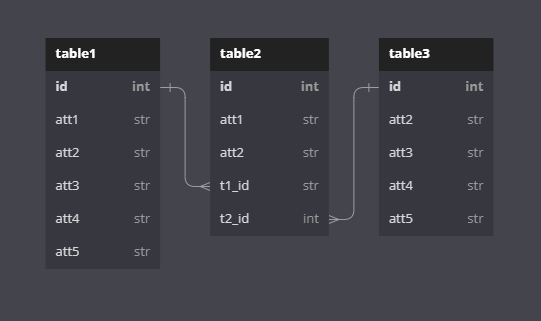

# Project Name
Author: [Your Name](your_github_profile)  
More Info: [Github](your_project_repo)

## Table of Contents
- [Project Name](#project-name)
  - [Table of Contents](#table-of-contents)
  - [Intro](#intro)
  - [Setup](#setup)
    - [Dependencies](#dependencies)
    - [Start Servers](#start-servers)
  - [Models](#models)
  - [Routes](#routes)
    - [/Route1](#route1)
      - [METHOD1](#method1)
      - [METHOD2](#method2)
      - [METHOD3](#method3)
    - [/Route2](#route2)
      - [METHOD1](#method1-1)
      - [METHOD2](#method2-1)
      - [METHOD3](#method3-1)
  - [Credits](#credits)
## Intro
{intro}
In this repo:
  - {part}: {description}
  - {part}: {description}
  - {part}: {description}


{project description}

## Setup
### Dependencies
To download the dependencies for the frontend and backend, run:
```bash
pipenv install
pipenv shell
npm install --prefix client
```
### Start Servers
You can run your Flask API on localhost:{port} by running:
```bash
python server/app.py
```
You can run your React app on localhost:{port} by running:
```bash
npm start --prefix client
```
***
## Models


The file `server/models.py` defines the model classes.

Use the following commands to create the initial database app.db:
```python
export FLASK_APP=server/app.py
flask db init
flask db upgrade head
```
The tables have the same relationships as shown in the ER Diagram:
- A(n) {object1} has {one / many} {object2} through {joining object} [cascading]
- A ____ has ____ ____ through ____
  

**Serialization is used to limit the recursion depth.**

To migrate and seed the database:
```python
flask db revision --autogenerate -m 'message'
flask db upgrade head
python server/seed.py
```

***
## Routes

The Flask api provided has the following routes

### /Route1

#### METHOD1
  - Description: {description}
  - Requires:
    ```python
    {example Requirement}
    ```
  - Returns:
    ```python
    {example return}
    ```
  - Validation:
    - {att}: {description}
    - {att}: {description}
#### METHOD2
  - Description: {description}
  - Requires:
    ```python
    {example Requirement}
    ```
  - Returns:
    ```python
    {example return}
    ```
  - Validation:
    - {att}: {description}
    - {att}: {description}
#### METHOD3
  - Description: {description}
  - Requires:
    ```python
    {example Requirement}
    ```
  - Returns:
    ```python
    {example return}
    ```
  - Validation:
    - {att}: {description}
    - {att}: {description}
  
### /Route2

#### METHOD1
  - Description: {description}
  - Requires:
    ```python
    {example Requirement}
    ```
  - Returns:
    ```python
    {example return}
    ```
  - Validation:
    - {att}: {description}
    - {att}: {description}
#### METHOD2
  - Description: {description}
  - Requires:
    ```python
    {example Requirement}
    ```
  - Returns:
    ```python
    {example return}
    ```
  - Validation:
    - {att}: {description}
    - {att}: {description}
#### METHOD3
  - Description: {description}
  - Requires:
    ```python
    {example Requirement}
    ```
  - Returns:
    ```python
    {example return}
    ```
  - Validation:
    - {att}: {description}
    - {att}: {description}

---
## Credits
- [Readme Template](https://github.com/pithlyx/readme) : [Cody 'Pithlyx' Roberts](https://github.com/pithlyx)
- [Asset](link_to_asset): [Author](link_to_author)
- [Asset](link_to_asset): [Author](link_to_author)
- [Asset](link_to_asset): [Author](link_to_author)